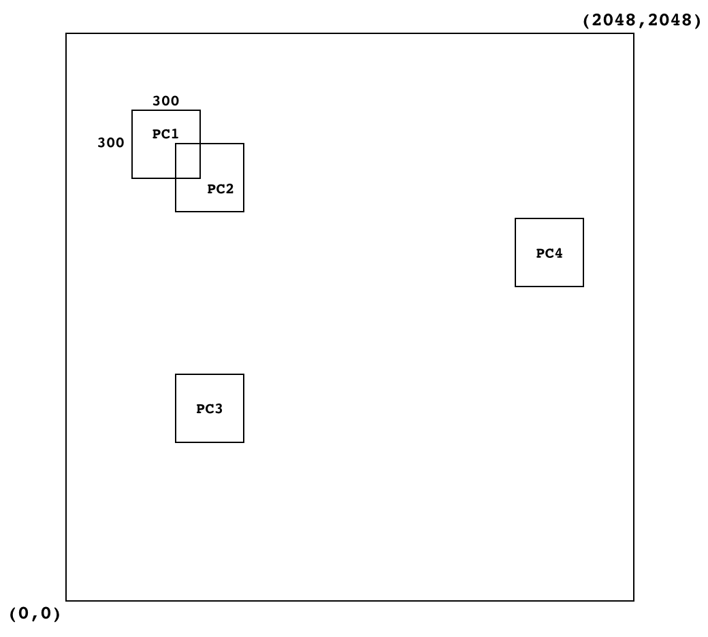
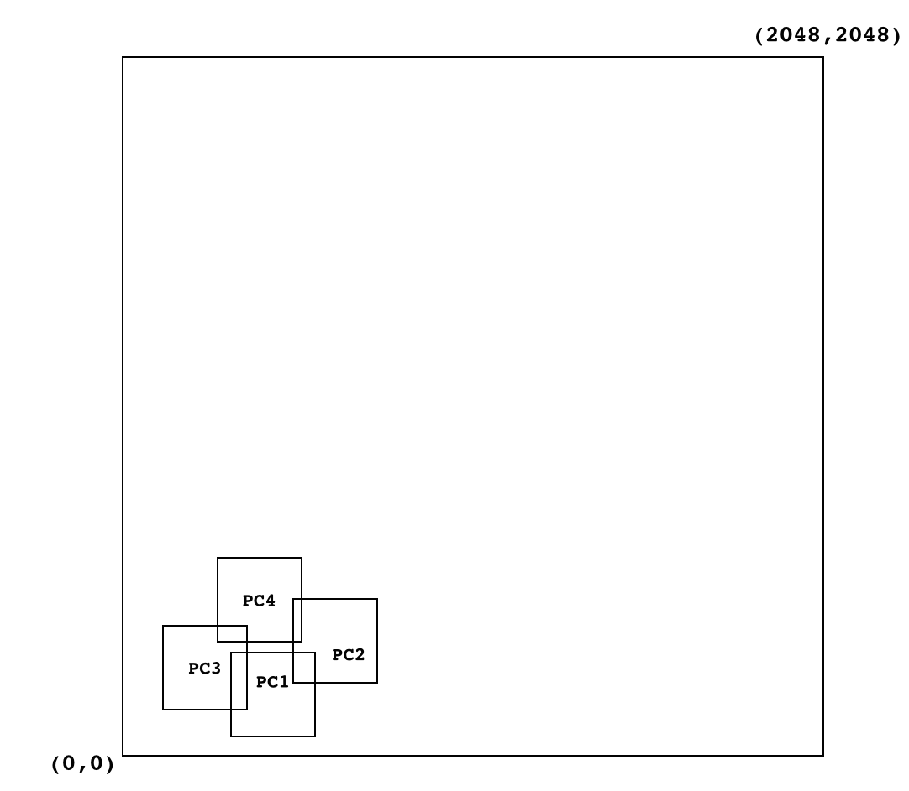

バックエンドサーバーの使い方
====

バックエンドサーバーは、LinuxまたはMacOS X上で動作する、
マルチプレイゲームを実装するための通信サーバーです。

リアルタイムモードとデータベースモードの2つのモードがあり、
ひとつのプロセスで両方のモードの機能を同時に提供できます。

VCEを用いて実装されており、通信のプロトコルは ssproto.txtファイルで定義されています。


## ソースコード
ソースコードは、 ```CCDK/backend``` にあります。
ビルドすると ssvと ssbenchという2つのプログラムが生成されます。

バックエンドサーバーのソースコードは全体が公開されています。
自動生成される分をのぞいた実質的なC++コードは、
コメントも入れてmain.cppとpresence.hの2つで合計約2000行の小さなものです。

現状のバージョンで実装されていない機能を追加したり、
不要な機能を削除したり自由に改変し、プロジェクトで利用してください。

またシンラ・システムでは、ゲームサーバーをスケールアウトさせる場合に、
必ずCCDKに添付されているbackendサーバーを利用する必要があるわけではありません。


## ssv 起動時のオプション

ssvを起動すると以下のような説明が表示されます。

~~~
bash$ ./ssv
Usage:
ssv realtime [OPTIONS]
ssv database [OPTIONS]
ssv realtime database [OPTIONS]
Options:
--dump-sp : dump shared projects with interval
--dump-p : dump projects with interval
--debug-protocol : abort on protocol parser error (for special debug case, dont use in production)
--maxcon=NUMBER : set max number. Absolute max is 200. Requires huge memory if maxcon gets larger.
--emulate-slow-disk=NUMBER : Enable slow disk emulation by milliseconds (sleep after each disk access) 
--channel_max=NUMBER : set max concurrent number of channel members.
--tcp_timeout=SECONDS : set TCP timeout for database and realtime connections
--enable-fsync : Use fsync() when writing a static file (not affect on Redis storage)
--redis-addr HOSTNAME : Address of the redis server.  Default is localhost
~~~

ssvは最低1個の引数が必要です。
以下はすべて有効なコマンドラインです。

```realtime``` または ```database``` は、動作モードを指定するもので、
どちらかひとつか両方を必ず指定する必要があります。

~~~
bash$ ./ssv realtime
bash$ ./ssv database
bash$ ./ssv database realtime
bash$ ./ssv database realtime --maxcon=20
bash$ ./ssv database --maxcon=20 --redis-addr 192.168.1.181
bash$ ./ssv database realtime --maxcon=20 --dump-sp --dump-p
bash$ ./ssv database realtime --emulate-slow-disk=5
bash$ ./ssv database realtime --channel_max=300 --redis
bash$ ./ssv realtime --channel_max=300
~~~

それぞれのオプションの意味は次の通りです。

* ```--dump-sp``` 一定時間ごとに、共有されているプロジェクトの一覧を表示し続けます。デバッグ用です。
* ```--dump-p``` 一定時間ごとに、バックエンドサーバーがホストしているプロジェクトの一覧を表示し続けます。デバッグ用です。
* ```--debug-protocol``` 受信したRPCの関数に関して、詳しいログを出力します。非常に膨大な量のログを生成するので、開発以外の目的で使用するのは危険です。
* ```--maxcon=NUMBER``` 最大接続数を指定します。設定限界値は200です。上限の理由は、通信に必要なメモリバッファのサイズです。(VCEが固定サイズを最初に確保するため)
* ```--emulate-slow-disk=NUMBER``` 回転式のHDDのような遅いディスクをバックエンドサーバーでエミュレートし、databaseモードのサービスに遅延を発生させます。これによってゲームの動作がどのように影響を受けるかを検証できます。
* ```--channel_max=NUMBER``` 同時にアクティブになっているチャネルの合計数の最大値を設定します。
* ```--tcp_timeout=SECONDS``` TCPのタイムアウト時間を設定します。デフォルトは10秒に設定されています。
* ```--enable-fsync``` 静的ファイルに書き込んだ後にfsync()を毎回発行します。Redisに対する操作に影響はありません。
* ```--redis-addr HOSTNAME``` Redisサーバーの位置を指定します。デフォルト値は ```localhost```です。


##ssproto.txtの修正方法


UNIX(Linux, MacOS X)環境では、簡単にssproto.txtの内容を変更して、新しいコマンドを追加したりできます。

以下、コマンドを追加した場合に必要な手順は以下の通りです。

1. ssproto.txtの内容を変更する。たとえば、 ```=c2s foo( int bar )``` という、クライアントから発行するコマンドを定義したとします。
2. ビルドします。 VCEのgen.rbが動作し、 ssproto_sv.cpp, ssproto_sv.h, ssproto_cli.cpp, ssproto_cli.h などが生成されます。
3. ssproto_foo_recv()関数が未定義であるというコンパイルエラーが表示されます。
4. ssproto_foo_recv()関数の実体をサーバー側に定義します。
5. ssproto_foo_send()関数をクライアント側で呼び出して動作確認を行います。

CCDKでは将来、Windowsにおいてもssproto.txtを変更した場合のビルドができるようにする予定です。

gen.rbの詳しい仕様については、VCEのドキュメントを参照してください。


## ssbench

ssbenchは、ssvに負荷をかけるためのベンチマークツールです。 UNIX環境において、 ビルド時にssvと同じディレクトリに同時にコンパイルされます。

ssbenchをオプション無しで起動すると以下のように使用方法が表示されます。

~~~~
Usage:
ssbench (realtime|database) [--host=IPADDR] [--maxcon=NUMBER] [--channel=NUMBER] [--range=DISTANCE] [--filenum=NUMBER] [--filesize=NUMBER]
~~~~

ssbenchの動作モードは、realtimeまたはdatabaseの2通りがあり、2種類同時には実行できません。

それぞれのオプションの意味は以下の通りです。
- ```--host=IPADDR```   負荷をかけるssvサーバのIPアドレスを指定します。 例: ```--host=192.168.11.10```
- ```--maxcon=NUMBER``` 最大同時接続数を指定します。デフォルトは4です。 例: ```--maxcon=100```
- ```--channel=NUMBER``` 負荷をかけるチャネルの番号を指定します。たとえばスペース・スウィーパーではプロジェクトのIDをここで指定することで、実際に稼働中のゲームに負荷をかけることができます。 例: ```--channel=38``` デフォルトは1です。
- ```--range=DISTANCE```  realtimeモードで使用する、nearcast関数の座標を散らせる範囲を指定します。詳細は後述します。 例: ```--range=1000```
- ```--filenum=NUMBER``` databaseモードで使用する、セーブするファイルの数を指定します。デフォルトは1024です。例: ```--filenum=65536``` 数を大きくするほど、ひとつのファイルに対する繰り返しアクセスの頻度が下がり、ディスク使用量が増えます。
- ```--filesize=NUMBER``` databaseモードで使用する、セーブするファイルのサイズを指定します。デフォルトは8192です。　例: ```--filesize=512``` 数を大きくするほど、ディスク使用量が増えます。

以下のコマンドラインはすべて有効です。

~~~
./ssbench realtime
./ssbench realtime --host=127.0.0.1 --maxcon=50
./ssbench realtime --maxcon=50 --channel=1212 --range=500
./ssbench database
./ssbench database --filenum=10000 --filesize=500
~~~

### ```--range=DISTANCE``` の設定方法

ssbench の realtime モードでは、nearcast関数をひとつのチャネルに対して大量に送りつけることによってssvの性能を測定します。大量とは、1ソケットあたり毎秒平均1500回です(33ミリ秒ごとにランダムに1〜100個送信)。接続数が増えると、送信量は比例して増加します。

ここで、全部の接続が同一のチャネルにjoinしていることに注意してください。
つまり、同じチャネルに10本接続している状態で1回のnearcast関数を送信すると、自分以外の9本の接続に対して、nearcast_notify関数が送られます。
このことから、基本的にはチャネルからデータを受信する量は、送信した量の2乗に比例して増えることがわかります。 
channelcast関数の場合は実際にそうなりますが、nearcast関数は、座標の情報を使って判定し、送信しない場合があるのでchannelcastよりも使用する帯域は減ります。

nearcast関数の引数は、ssproto.txtでは以下のように定義されています。

~~~
=c2s 240 nearcast( int x, int y, int range, int type_id, char data[PACKET_SIZE_MAX])
~~~

```int x, int y``` この2つの引数は、ゲームの事象が起きた座標を意味します。
```--range``` を指定することにより、このx,yの値を散らせる範囲を調整できます。デフォルトは0で、すべてのパケットが、ゲームマップ上の起点(0,0)で発生することになります。
```--range=1000``` を設定すると、x,yの値がともに0から999の範囲に散ります。

nearcast関数のrange引数は、ssbenchでは常に300に固定されています。これは、事象が起きた点から300以内にいるプレイヤー( update_nearcast_position関数を利用して1秒に5回ランダムに更新します)に対してこのパケットを同報せよという意味です。
これを「聞こえる範囲」と呼びます。「聞こえる範囲」の値300は、スペース・スウィーパーの標準値です。

最後の実際のゲームデータ ```data``` は、ssbenchでは固定で32バイトのバイナリデータを送信しています。32バイトは、スペース・スウィーパーにおける標準的なパケットサイズです。


スペース・スウィーパーではマップの広さが2048で、聞こえる範囲が300となっているため、プレイヤーキャラクターの位置は以下の図のようにマップ全体に分散しています。




この状態は、 ```--range=2048``` に相当します。
図で、PC1とPC2は互いに聞こえる範囲に入っているため、PC1が送信したデータはPC2に送られます。しかしPC3とPC4には送られません。また、PC3が送信したデータは、誰も聞こえる範囲に居ないので、誰にも送られません。　もし、すべてのプレイヤーの聞こえる範囲が互いに重なっていない場合は、チャネルから受信するデータは何もないということになります。

このように300以上離れている人にはnearcast_notifyを送らないので、チャネルから受信する量は、送信した量の2乗に比例して増えないことがわかります。

次に、```--range=500``` などとして小さい範囲に設定した場合の図を示します。



上図では、PC1が送信したデータは、PC3とPC2に対して送信されます。
座標が分散する範囲を狭くすればするほど、多くのプレイヤーが「聞こえる範囲」に入るため、だんだんと2乗に比例するchannelcastの状態に近くなります。
デフォルトでは散る範囲は0なので、channelcastと同等のトラフィックが発生することになります。

座標がどのように分散するかは、完全にゲームの内容によります。スペース・スウィーパーでも、実際にはプレイヤーがまんべんなくマップ上に散ることはないため、実際にはかなり偏ったトラフィックが発生します。


