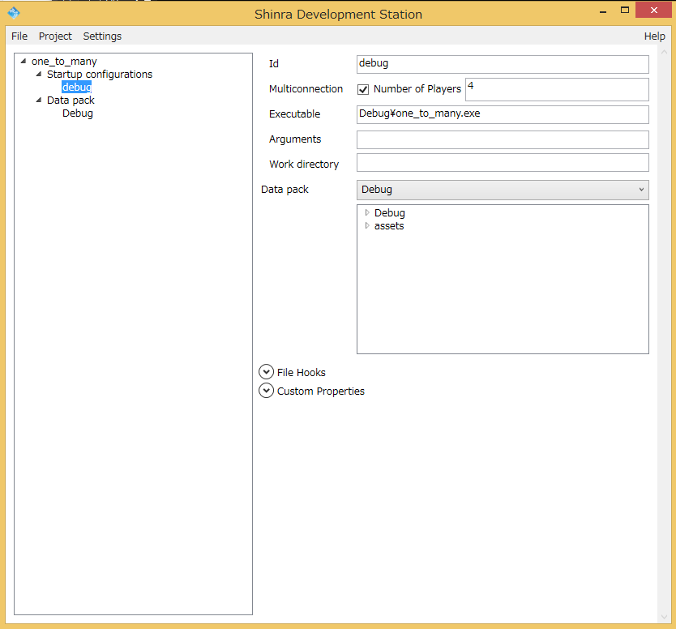
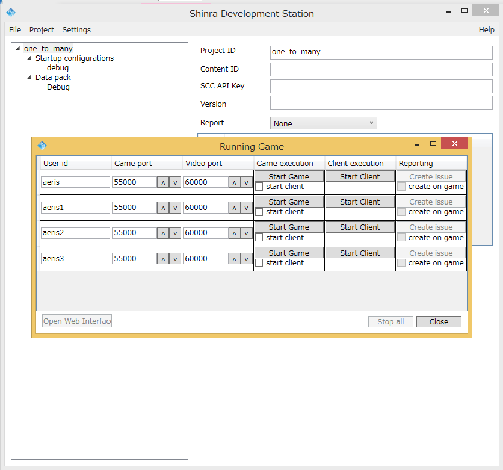

1:N スケルトンのセットアップ
====

[CCDKセットアップ手順](./Setup.ja.md) では、1:1とN:Nのスケルトンコードをセットアップしました。 1:Nのセットアップ方法については、このドキュメントで説明します。


1:N APIの詳細については、 [ShinraGameAPI](../mcs/Doc/API/ShinraGameAPI.md) を参照してください。


1:Nセットアップのポイント
====

大まかには以下の手順で行います。

1:Nスケルトンは、1:1やN:Nと異なり、実際にプレイするには、
かならずストリームを経由する必要があります。
そのため、VisualStudioだけで完結せず、
ShinraDevelopmentStationを使ってshinraプロジェクトを操作する必要があります。


1. 1:1スケルトンをストリーミングプレイできることを確認する
2. 1:Nスケルトンをビルドする(1回目)
3. SDSを使ってone_to_manyプロジェクトを作る
4. 1:NスケルトンをVisualStudioでビルドする(2回目)
5. 1:NスケルトンをVisualStudioからデバッグ実行する


<B>手順1. 1:1スケルトンをストリーミングプレイできることを確認する</B>

これは[CCDKセットアップ手順](Setup.ja.md) で説明しています。
1:1のセットアップをすべて完了している場合は、この手順は飛ばしても構いません。

<B>手順2. 1:Nスケルトンをビルドする</B>

```CCDK/CCDK.sln``` に one_to_manyという名称のプロジェクトが含まれています。
ビルド自体は、 1:1スケルトンをセットアップしたときにソリューション全体をビルドしていれば、そのときに完了しているはずです。念のため、プロジェクトを単体で「ビルド」してください。

1:Nスケルトンのプロジェクトでは、ビルド後イベントが次のように設定されていますが、
このスクリプトが動作するためには手順3でSDSを使ってゲームを一度デプロイしておく必要があるので、1回めではこのビルド後イベントについては、プロジェクトのプロパティで
「ビルドで使用」を「いいえ」に設定してください。「はい」にするとビルドエラーになります。

~~~
$(ProjectDir)..¥..¥mcs¥python¥shinra.py setup one_to_many debug aeris 55000 60000
~~~

<B>手順3. SDSを使ってone_to_manyプロジェクトを作る</B>

ShinraDevelopmentStation.exe(SDS)を起動し、プロジェクトを新規作成します。
プロジェクトの位置はどこでもかまいません。名称は one_to_many とします。
これをセーブすると one_to_many.shinraが作成されます。

DataPackは CCDK/skeletons/one_to_many ディレクトリをそのまま指定します。
Startup configは Idをdebugとし、 MultiConnection数を4に設定します。(次図)

</img>

Executableは、デバッグビルドしてできた成果物である
Debug¥one_to_many.exe をそのまま指定します。

これでプロジェクトの作成は完了です。保存して、
debugをスタートしてみると、以下のようなウインドウが表示されます。

</img>

4行表示されていて、最大4人までの同時プレイができることがわかります。

ここで一番上の行(図のaerisというユーザー名の行)について"Start Game"をします。
まずはstart clientチェックボックスを外した状態でやっってみてください。
すると、one_to_oneなどと同様、真っ白のウインドウが一つ表示されます。
これが1:Nのゲームサーバーになります。
次に、aerisの行のStart Clientを押します。
するとクライアントがゲームサーバーに接続し、
one_to_many.exeプログラム(Game.cpp)内のGame::addPlayerが呼ばれ、
レンダリングコンテキストが1つ作成され、ストリームが開始されます。
画面のカウンタの数値が増えていっていれば、動作確認は完了です。
2人目以降は、ゲームサーバーを新規に立ち上げる必要はありません。
ポート番号をそのままにして、Start Clientを順次押していけば起動することができます。
2つ目以降の画面でもカウンタが増えていきますが、
そのカウンタの値がそれぞれの画面で異なる値になっていることが確認できます。
これによって、ゲームサーバーのプロセスが、
レンダリングターゲットごとに異なる内容を描画していることがわかります。


<B>手順4. 1:NスケルトンをVisualStudioでビルドする(2回目)</B>

デバッグのたびにSDSのGUIを操作するのは面倒です。
そこで、今度は手順2で「ビルドで使用」をオフにしていたビルド後イベントを有効にします。
そうすると shinra.pyスクリプトが　setupコマンドを実行して、
ビルドした後に自動的に one_to_manyプロジェクトを再構築し、
ビルドしてできた新しいexeファイルを置き換えてくれます。

このスクリプトは、MCSのゲームインストールディレクトリの中に、one_to_manyというディレクトリを作成し、そこに必要なデータを格納し、ストリーミングプレイに必要なD3DXのフェイクDLLや、必要なJSONファイルなど一式をインストールします。　その際、debugというスタートアップ設定名でゲームを起動できるように設定します。 末尾のaerisはユーザー名、 55000はゲームポート番号、 60000はビデオポート番号です。それぞれデフォルト値です。


shinra.pyのより詳しい使用方法は、 [shinra.pyリファレンス](../mcs/Doc/MCS_README.md) を参照してください。


<B>手順5. 1:NスケルトンをVisualStudioからデバッグ実行する</B>

手順4で毎回セットアップをするようにしても、
デバッガを利用してデバッグするためには、VisualStudioやエクスプローラーの
面倒なGUIの操作がまだ必要です。
そこで、VisualStudioのデバッグ設定で、
デバッグ対象となるコマンドを、手順4でセットアップされている
exeファイルにすることでこの操作を自動化できます。

デフォルトでは以下の位置にゲームがインストールされます:

~~~
C:¥Shinra¥Games¥one_to_many
~~~

したがって、VisualStudioのデバッグ設定では以下のように

~~~
C:¥Shinra¥Games¥one_to_many¥Debug¥Debug¥one_to_many.exe
~~~

とします。

これでデバッガを利用した実行が簡単になります。


